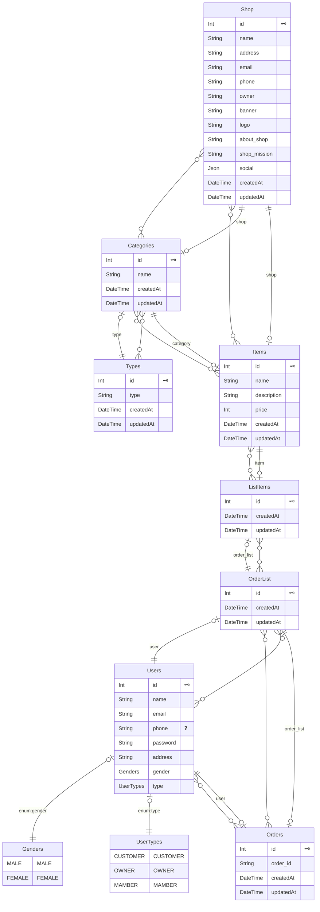

```mermaid
erDiagram

        Genders {
            MALE MALE
FEMALE FEMALE
        }
    


        UserTypes {
            CUSTOMER CUSTOMER
OWNER OWNER
MAMBER MAMBER
        }
    
  "Shop" {
    Int id "🗝️"
    String name 
    String address 
    String email 
    String phone 
    String owner 
    String banner 
    String logo 
    String about_shop 
    String shop_mission 
    Json social 
    DateTime createdAt 
    DateTime updatedAt 
    }
  

  "Users" {
    Int id "🗝️"
    String name 
    String email 
    String phone "❓"
    String password 
    String address 
    Genders gender 
    UserTypes type 
    }
  

  "Types" {
    Int id "🗝️"
    String type 
    DateTime createdAt 
    DateTime updatedAt 
    }
  

  "Categories" {
    Int id "🗝️"
    String name 
    DateTime createdAt 
    DateTime updatedAt 
    }
  

  "Items" {
    Int id "🗝️"
    String name 
    String description 
    Int price 
    DateTime createdAt 
    DateTime updatedAt 
    }
  

  "OrderList" {
    Int id "🗝️"
    DateTime createdAt 
    DateTime updatedAt 
    }
  

  "ListItems" {
    Int id "🗝️"
    DateTime createdAt 
    DateTime updatedAt 
    }
  

  "Orders" {
    Int id "🗝️"
    String order_id 
    DateTime createdAt 
    DateTime updatedAt 
    }
  
    "Shop" o{--}o "Categories" : ""
    "Shop" o{--}o "Items" : ""
    "Users" o|--|| "Genders" : "enum:gender"
    "Users" o|--|| "UserTypes" : "enum:type"
    "Users" o{--}o "OrderList" : ""
    "Users" o{--}o "Orders" : ""
    "Types" o{--}o "Categories" : ""
    "Categories" o|--|| "Types" : "type"
    "Categories" o|--|| "Shop" : "shop"
    "Categories" o{--}o "Items" : ""
    "Items" o|--|| "Categories" : "category"
    "Items" o|--|| "Shop" : "shop"
    "Items" o{--}o "ListItems" : ""
    "OrderList" o|--|| "Users" : "user"
    "OrderList" o{--}o "Orders" : ""
    "OrderList" o{--}o "ListItems" : ""
    "ListItems" o|--|| "OrderList" : "order_list"
    "ListItems" o|--|| "Items" : "item"
    "Orders" o|--|| "OrderList" : "order_list"
    "Orders" o|--|| "Users" : "user"
```
